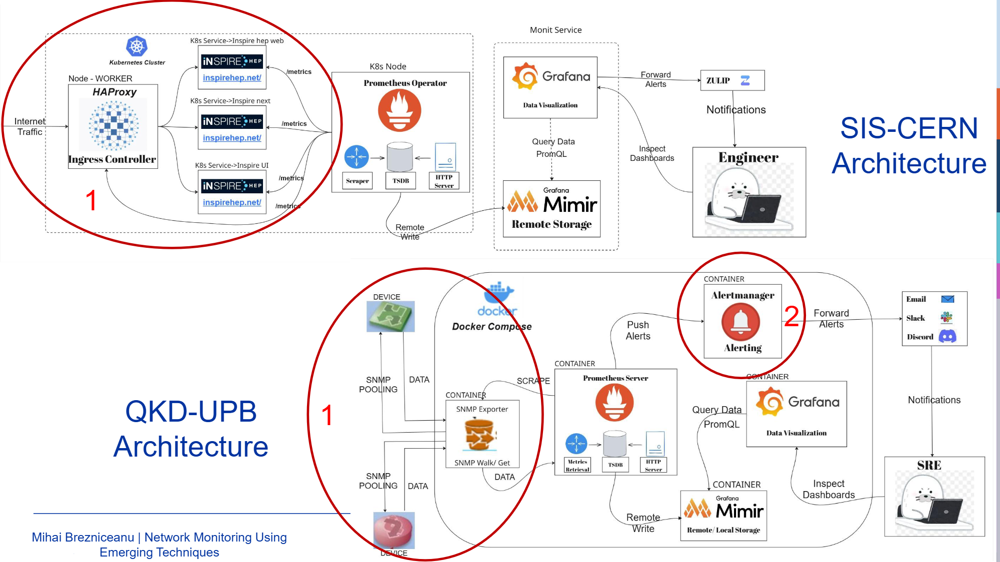

# Bachelor Thesis: Cluster and network monitoring

Hello guys,

This repository contains my **Bachelor Thesis**, developed during my 4th years and as a CERN Summer Student in Geneva.

The thesis focuses on **replicating and analyzing network monitoring mechanisms** used at CERN and applying them to a **QKD (Quantum Key Distribution) network at the University Politehnica of Bucharest (UPB)**.

The project combines **network monitoring infrastructure deployment, metric collection, and data interpretation**.

---

# Project Goals

The thesis is split into **two main areas**:

## 1. Replicating the CERN Monitoring Architecture

Replicate parts of the **CERN network monitoring solution** and use it on the **UPB QKD network infrastructure**.

Main objectives:

* Deploy monitoring components similar to CERN's stack
* Collect real-time metrics from network devices
* Store and visualize metrics

## 2 Metrics Interpretation & Analysis

Use collected metrics from **CERN infrastructure** and process them to extract meaningful information about the whole state of the network and aplications health.

Main objectives:

* Process time-series network metrics
* Identify anomalies and trends
* Extract relevant operational insights
* Understand network behavior under different conditions

---

# System Architecture

---

# Presentation & Overview

For a **high-level explanation of the architecture and results**, see the presentation:

👉
[Thesis Presentation](https://github.com/mihaibrezni/Bachelor-Degree-Network-Monitoring/blob/main/presentation/Mihai-Brezniceanu-Thesis-2025.pdf)

# Technologies Used

| Technology     | Purpose                       |
| ---------------| ----------------------------- |
| Prometheus     | Metrics collection            |
| Grafana        | Visualization dashboards      |
| SNMP Exporter  | Network device metrics        |
| Mimir          | Time-series database          |
| Alertmanager   | Alerting and notifications    |
| Kubernetes     | Container orchestration       |

---

## Have fun!
